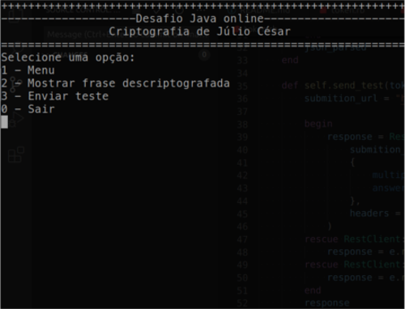

# aceleradev-java-online-4
Desafio de inscrição para o AceleraDev do Codenation

<style>
  .box {
    border: 10px solid rgba(255,255,255, 0.2);
    border-radius: 5px;
    margin-bottom: 30px;
  }
</style>


<p>

<a href="https://github.com/adrianoavelino">
    
</a>

<a href="https://github.com/EliasGcf/readme-template/commits/master">

</a>
</p>

## Sobre o projeto
Aplicação de linha de comando para realizar o desafio de criptografia do Aceleradev Java Online da Codenation.

O desafio resolve a criptografia de Júlio César acessando uma api para ter acesso a mensagem criptografada. Localmente é realizada a descriptografia da frase e resumo criptografado usando sha1 num arquivo json que é enviado via POST para receber a sua nota.

## Tecnologias
- rest-client
- rspec
- rickshaw

## Começando
- clone o projeto:
```sh
git clone https://github.com/my-study-area/aceleradev-java-online-4.git
```
- entre no repositório:
```sh
cd aceleradev-java-online-4
```
- execute o aplicação:
```sh
ruby app.rb
```

### Requisitos
- ruby 2.5.1p57

## Autor
Adriano Avelino
